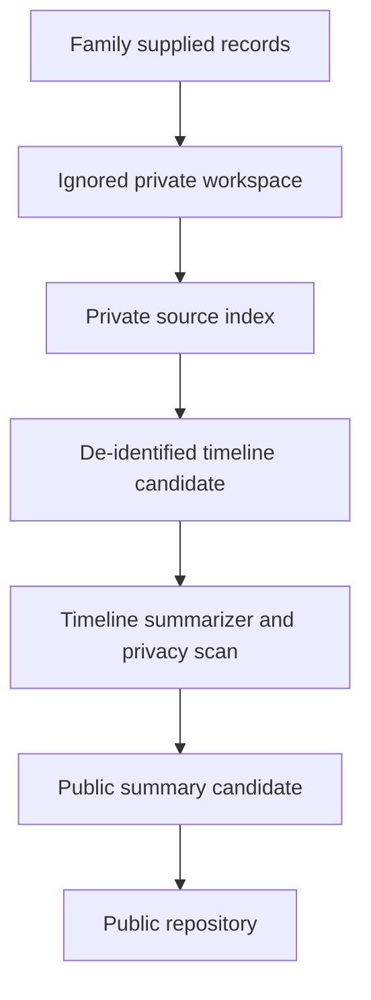

# Private Case Intake Threat Model

Status: assumption-gated working threat model, not a legal privacy opinion
Date: 2026-04-28

## Scope

This model covers the private case intake lane that turns family-supplied
medical records into public-safe research context.

In scope:

- ignored local workspace: `private/<case-code>/`;
- public templates: `templates/private-case-intake-index-template.md`,
  `templates/case-clinical-timeline-template.csv`;
- public checks: `scripts/check_public_repo.py`,
  `scripts/summarize_case_timeline.py`, `scripts/selftest_repo_checks.py`;
- public prose rules in `docs/repo-hygiene.md`.

Out of scope:

- clinical diagnosis or treatment decisions;
- legal HIPAA compliance certification;
- cloud storage or database handling not present in this repository.

## System Model

Evidence anchors:

- `.gitignore` ignores `private/`, `tmp/`, local environments, credentials, and
  LaTeX build outputs.
- `docs/repo-hygiene.md` defines the public privacy rule and private intake
  workspace.
- `scripts/check_public_repo.py` blocks private paths, raw case media, local
  references, common secrets, and case-context identifier patterns.
- `scripts/summarize_case_timeline.py` blocks day-level timeline dates unless
  `--private-input` is used and suppresses exact date windows by default.
- HHS de-identification guidance treats medical records and lab reports with
  names or other identifiers as protected health information, and warns that
  de-identification reduces but does not eliminate re-identification risk.
- NIST Privacy Framework is used as a risk-management anchor for identifying
  and managing privacy risk, not as a certification claim.

## Trust Boundaries

| Boundary | Data crossing | Controls | Residual risk |
| --- | --- | --- | --- |
| Local raw records to `private/` | raw PDFs, extracted text, local aliases | Git ignore, source aliases, no public commit | local filesystem compromise still exposes records |
| `private/` to public timeline candidate | de-identified facts, timing anchors, labels | row privacy scan, time-precision gate, release checklist | rare fact combinations may still identify someone |
| Public candidate to Git | Markdown, CSV templates, scripts, notebooks | public checker, language checker, self-tests, manual review | forced `git add -f` or checker gaps can bypass intent |

## Assets

| Asset | Security objective |
| --- | --- |
| Raw PDFs and scans | confidentiality and family safety |
| Private source index and timeline | confidentiality, integrity, reviewability |
| Public case summaries | confidentiality, scientific integrity, no treatment advice |
| Repo scripts and templates | integrity and repeatable checks |

## Threats And Priority

| Threat | Likelihood | Impact | Priority | Existing controls | Gaps |
| --- | --- | --- | --- | --- | --- |
| Raw record committed to public Git | Medium | High | High | `.gitignore`, blocked private/raw media paths, public checker | malicious or forced add can still bypass local habit |
| Identifier hidden in free text | Medium | High | High | case-context identifier patterns, row privacy scan | regex checks cannot catch all names, locations, or rare context |
| Exact person-linked date leak | Medium | Medium | Medium | default date suppression, `event_time_precision`, `--private-input` gate | user can still publish over-specific prose manually |
| Public summary becomes treatment advice | Medium | High | High | repo boundary language, release checklist, clinician-question framing | checker cannot fully detect subtle clinical advice |
| Private workspace loss or local compromise | Low | High | Medium | ignored local storage, no remote transfer by repo tooling | no encryption or backup policy is defined in repo |

## Mitigations

Keep:

- `private/` ignored and blocked if force-added;
- no raw PDFs, scans, local paths, doctor names, hospital names, exact birth
  dates, or person-linked day-level public dates;
- public case text framed as missing records, extracted context, or clinician
  questions;
- `check_public_repo.py`, `check_repo_language.py`, and self-tests before
  every case-context commit.

Add later if private intake expands:

- a private-workspace permission check;
- explicit local encryption guidance;
- a pre-commit wrapper that runs the public checker before any push;
- a manual two-person release checklist for new case facts.

## Assumptions Requiring Confirmation

1. The repository remains public on GitHub and should not contain raw medical
   records.
2. Private intake artifacts stay only on the operator's local machine under
   ignored `private/`.
3. No cloud sync folder, shared drive, or external automation is used for raw
   case records unless a separate threat model is written.

These assumptions materially affect risk ranking. If any are wrong, the top
risks become cloud sharing, access control, and audit logging rather than only
public Git leakage.

## Source Anchors

- [HHS de-identification guidance](https://www.hhs.gov/hipaa/for-professionals/privacy/special-topics/de-identification),
  checked 2026-04-28.
- [NIST Privacy Framework](https://www.nist.gov/privacy-framework), checked
  2026-04-28.
